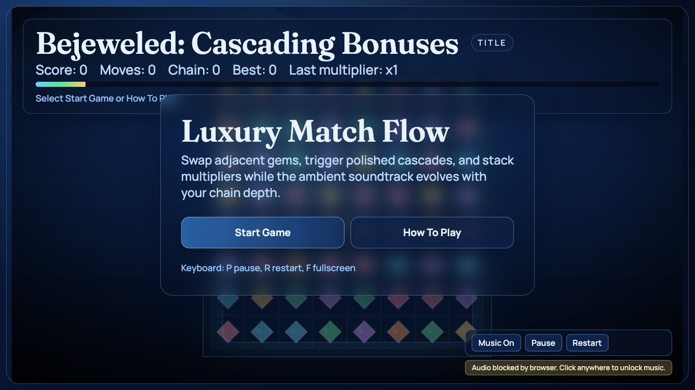
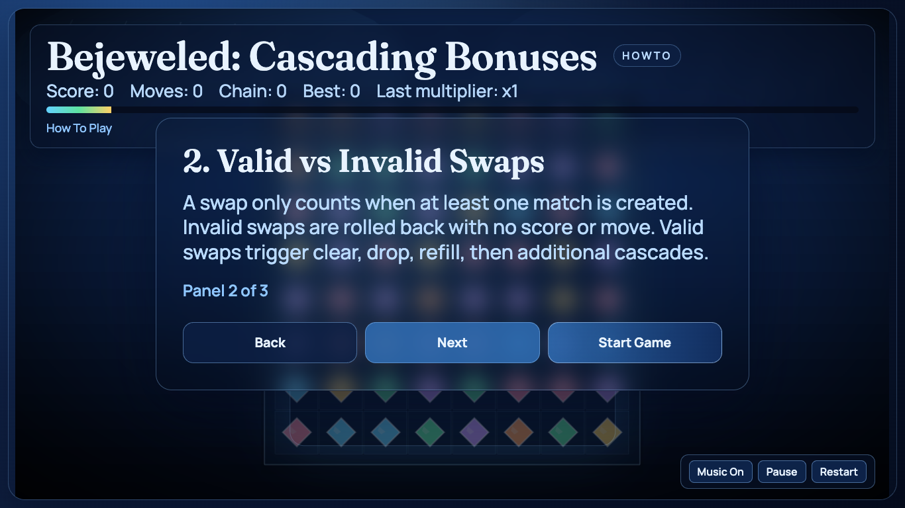
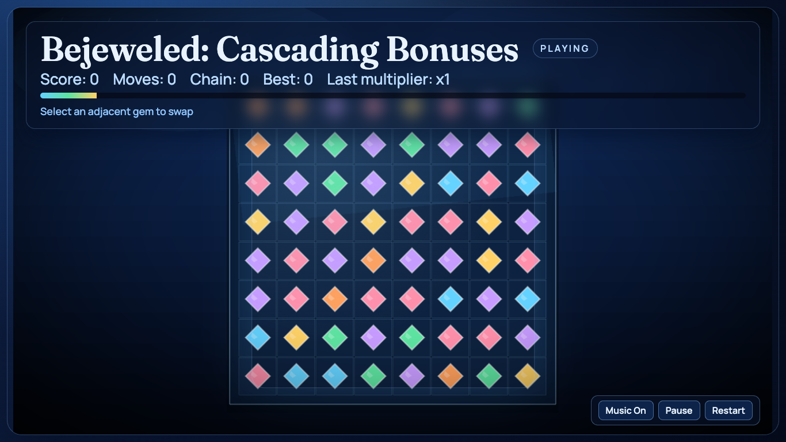
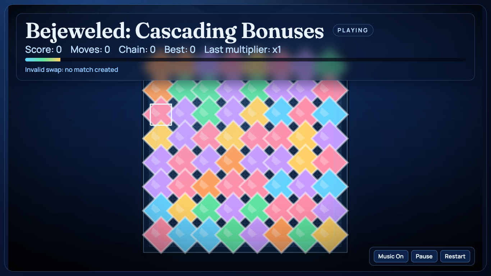
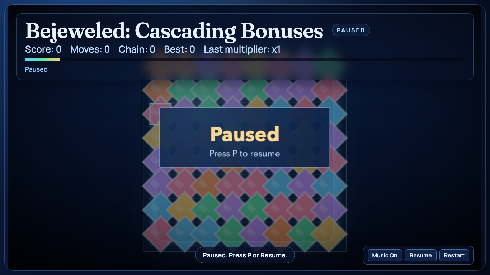

# daily-classic-game-2026-02-10-bejeweled-cascade-bonuses

<p align="center">
  <strong>Bejeweled: Cascading Bonuses</strong><br/>
  Hybrid React + Phaser match-3 with luxe visuals, deterministic runtime hooks, and ambient in-game soundtrack.
</p>

<p align="center">
  
</p>

## Visual Captures
### Menu (React Overlay + Phaser Board)
<p align="center">
  
</p>

### How To Play Panels
<p align="center">
  
</p>

### Gameplay + Invalid Swap + Pause
<p align="center">
  
</p>
<p align="center">
  
</p>
<p align="center">
  
</p>

## Quick Start
```bash
pnpm install
pnpm dev
pnpm test
pnpm build
```

## Music
- Ambient luxe loops are bundled locally in `assets/audio/`.
- Runtime starts music automatically; if browser blocks autoplay, first click/key unlocks audio.
- UI controls allow quick `Music On/Off` toggling during play.

## How To Play
- First screen has exactly two actions: `Start Game` and `How To Play`.
- `How To Play` shows 3 panels:
- Objective + Controls
- Valid vs Invalid Swaps
- Cascades + Scoring
- Controls:
- Mouse: select one gem, then an adjacent gem to swap
- `P`: pause/resume
- `R`: restart to same seed
- `F`: fullscreen

## Rules
- Adjacent swaps only.
- Invalid swaps are reverted (no score/move gain).
- Valid swaps resolve clear -> drop -> refill cascades.
- Mode transitions:
- `title -> playing` via `startGame()`
- `title -> howto -> playing`
- `playing <-> paused` via `pause()` / `resume()`

## Scoring
- Base score: `50` points per cleared gem.
- Chain multipliers:
- chain 1: `x1`
- chain 2: `x2`
- chain 3+: `x3`
- Deterministic scripted validation (`?scripted_swap=1`) still yields stable expected state evolution.

## Hook Contract
Preserved browser hooks:
- `window.advanceTime(ms)`
- `window.render_game_to_text()`

Preserved `GameSnapshot` fields:
- `mode`, `score`, `moves`, `chainDepth`, `bestChain`, `board`, `selectedCell`, `pendingAnimations`, `seed`, `coordinateSystem`

## Verification
```bash
pnpm test
pnpm build
```

Capture updated visuals (with dev server running):
```bash
WEB_GAME_URL="http://127.0.0.1:4173/" node scripts/capture_react_luxe.mjs
```

## Project Location
- `{AUTOMATIONS_DIR}/daily-classic-game/games/2026-02-10-bejeweled-cascade-bonuses`

## Layout
```text
src/
  main.tsx                      # React root
  style.css                     # Tailwind + base styles
  react/
    AppShell.tsx                # overlay UI + runtime bridge + audio controls
    useRuntimeSnapshot.ts       # runtime subscription hook
    howto_panels.ts             # 3-panel tutorial content
    audio.ts                    # ambient soundtrack director
  phaser/
    game.ts                     # Phaser boot
    runtime.ts                  # deterministic state machine
    runtime_store.ts            # shared runtime instance
    pipelines/
      LuxeVignettePipeline.ts   # post-process vignette shader
    scenes/
      GameScene.ts              # board render/input/fx
    ui/
      theme.ts
      components.ts
assets/
  audio/
    ambient-luxe-base.wav
    ambient-luxe-glow.wav
scripts/
  self_check.mjs
  capture_react_luxe.mjs
playwright/
  react-luxe/
```
