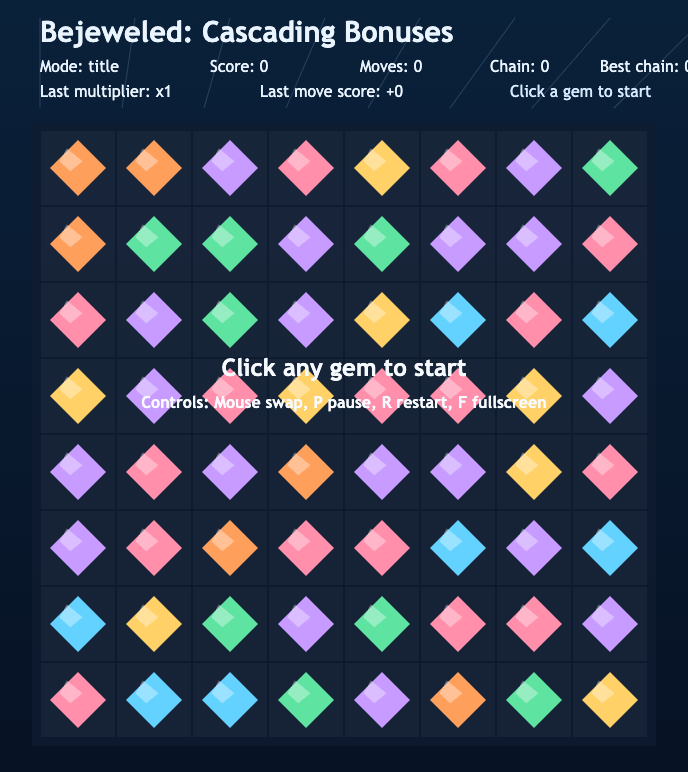
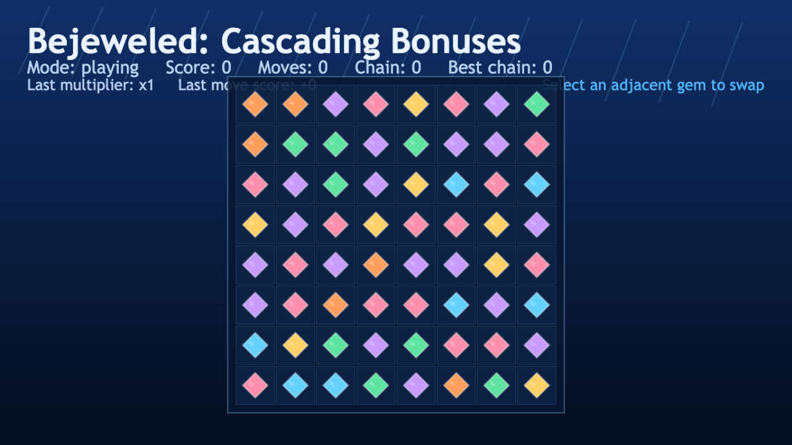

# daily-classic-game-2026-02-10-bejeweled-cascade-bonuses

<p align="center">
  <strong>Bejeweled: Cascading Bonuses</strong><br/>
  Phaser-powered, deterministic match-3 with menu-first onboarding and automation-safe hooks.
</p>

<p align="center">
  
</p>

## GIF Captures
### Menu + How To Play Flow
<p align="center">
  
</p>

### Gameplay (No Scroll, Full Viewport)
<p align="center">
  
</p>

### Invalid Swap + Pause
<p align="center">
  
</p>

## Quick Start
```bash
pnpm install
pnpm dev
pnpm test
pnpm build
```

Open the local URL printed by Vite.

## How To Play
- First screen is a menu with exactly two options: `Start Game` and `How To Play`.
- `How To Play` is a 3-panel walkthrough covering controls, swap rules, and cascade scoring.
- In-game controls:
- Click one gem, then click an adjacent gem to swap.
- `P` pause/resume.
- `R` restart to seeded initial state.
- `F` fullscreen toggle.

## Rules
- Only adjacent swaps are accepted.
- Swaps that do not produce a match are reverted.
- Valid swaps resolve match clear, drop, refill, then any additional cascades.
- `mode` transitions: `title -> playing` via `startGame()`, `title -> howto -> playing`, and `playing <-> paused` (`resume()` returns paused to playing).

## Scoring
- Base score: `50` points per cleared gem.
- Cascade multipliers by chain depth:
- Chain 1: `x1`
- Chain 2: `x2`
- Chain 3+: `x3`
- Scripted deterministic validation (`?scripted_swap=1`) yields `score=550`, `moves=1`, `chainDepth=2`.

## Twist
Cascading bonuses reward setup play: one valid swap can chain through multiple resolve loops, each applying a larger multiplier.

## Project Location
- `{AUTOMATIONS_DIR}/daily-classic-game/games/2026-02-10-bejeweled-cascade-bonuses`

Primary docs in-folder:
- `README.md`
- `design.md`
- `progress.md`
- `docs/plans/2026-02-10-bejeweled-cascade-bonuses-implementation.md`

## Verification
```bash
pnpm test
pnpm build
```

Automation hooks available in browser:
- `window.advanceTime(ms)`
- `window.render_game_to_text()`

Required snapshot keys preserved:
- `mode`
- `score`
- `moves`
- `chainDepth`
- `bestChain`
- `board`
- `selectedCell`
- `pendingAnimations`
- `seed`
- `coordinateSystem`

## Project Layout
```text
src/
  main.ts                     # Phaser bootstrap + browser hooks
  constants.ts                # seed, board dimensions, scoring, timing
  types.ts                    # shared state + payload types
  rng.ts                      # deterministic seeded PRNG
  board.ts                    # board initialization and swap helpers
  match.ts                    # match scanning and clear logic
  cascade.ts                  # clear/drop/refill resolve loop with multipliers
  phaser/
    game.ts                   # Phaser config (FIT + CENTER_BOTH)
    runtime.ts                # deterministic game state runtime
    runtime_store.ts          # shared runtime singleton
    scenes/
      MenuScene.ts            # Start Game / How To Play entry
      HowToScene.ts           # 3-panel tutorial with Back/Next/Start Game
      GameScene.ts            # gameplay rendering/input, pause/restart/fullscreen
    ui/
      theme.ts                # color and typography tokens
      components.ts           # reusable backdrop/panel/button helpers
scripts/
  self_check.mjs
playwright/
  ux-remediation/             # menu/howto/gameplay verification artifacts
```
