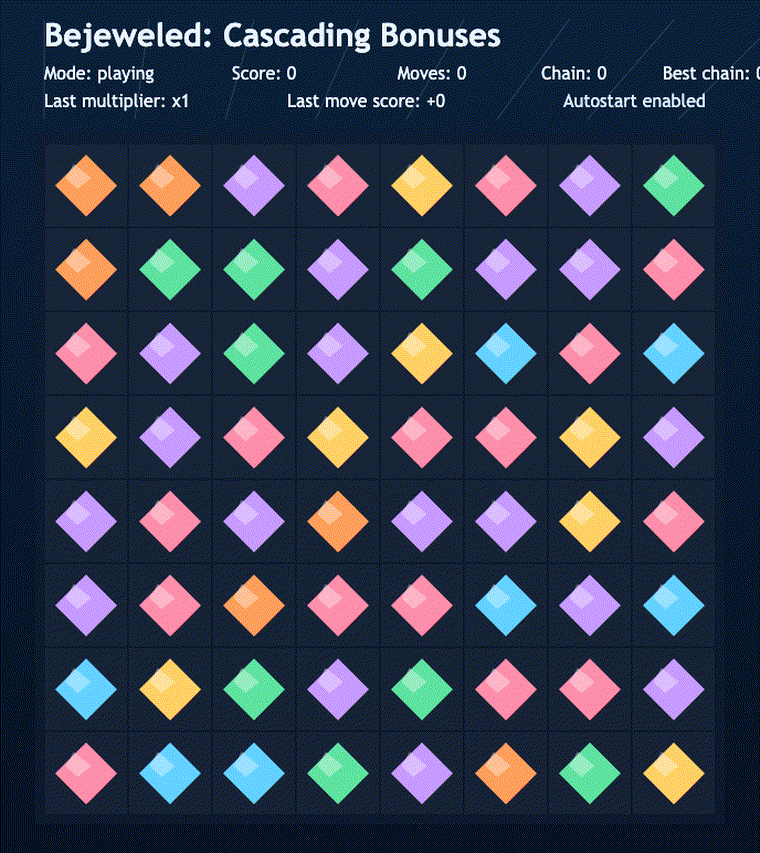
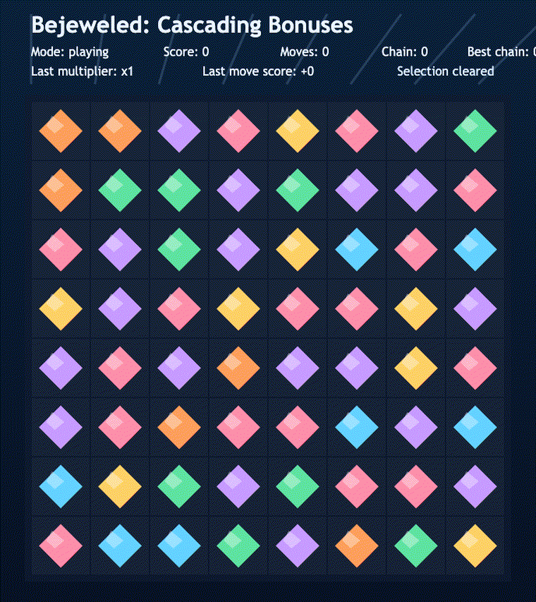
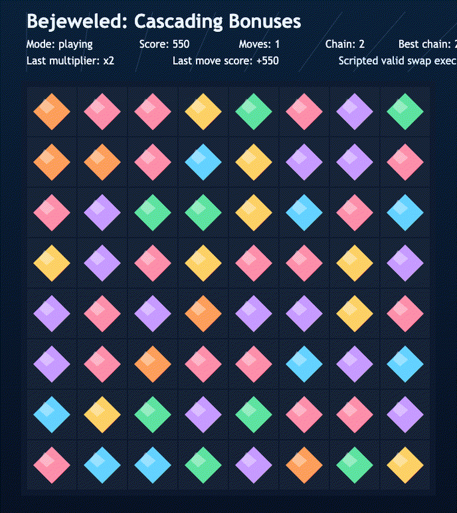

# daily-classic-game-2026-02-10-bejeweled-cascade-bonuses

<p align="center">
  <strong>Bejeweled: Cascading Bonuses</strong><br/>
  Deterministic match-3 with chain multipliers, replayable seeded boards, and automation-ready browser hooks.
</p>

<p align="center">
  
</p>

## GIF Captures
### Pause Cycle
<p align="center">
  
</p>

### Selection Cycle
<p align="center">
  
</p>

### Cascade Bonus Resolution
<p align="center">
  
</p>

## Quick Start
```bash
pnpm install
pnpm dev
```

Open the local URL printed by Vite.

## How To Play
- Click one gem, then click an adjacent gem to swap.
- Create horizontal or vertical matches of 3+ gems.
- Press `P` to pause/resume.
- Press `R` to restart the run.
- Press `F` to toggle fullscreen.

## Rules
- Only adjacent swaps are accepted.
- Swaps that do not produce a match are reverted.
- Matches clear, gems drop, and the board refills deterministically.
- Chain depth increases when consecutive cascades resolve in one move.

## Scoring
- Base score: `50` points per cleared gem.
- Cascade multipliers by chain depth:
- Chain 1: `x1`
- Chain 2: `x2`
- Chain 3+: `x3`
- Example from scripted verification run: `score=550`, `moves=1`, `chainDepth=2`.

## Twist
Cascading bonuses reward aggressive setup. One swap can trigger multiple resolve loops; each loop increases the multiplier and stacks additional score.

## Project Location
- `/Users/testaccountforsystem-wideissues/.codex/automations/daily-classic-game/games/2026-02-10-bejeweled-cascade-bonuses`

Primary docs in-folder:
- `README.md`
- `design.md`
- `progress.md`
- `docs/plans/2026-02-10-bejeweled-cascade-bonuses-implementation.md`

## Verification
```bash
pnpm test
pnpm build
```

Automation hooks available in browser:
- `window.advanceTime(ms)`
- `window.render_game_to_text()`

## Project Layout
```text
src/
  main.ts       # runtime loop, state transitions, input handling, hooks
  constants.ts  # board dimensions, scoring, palette, timing
  types.ts      # shared game and payload types
  rng.ts        # deterministic seeded PRNG
  board.ts      # board initialization and swap helpers
  match.ts      # match scanning and clear logic
  cascade.ts    # clear/drop/refill resolve loop with multipliers
  input.ts      # canvas click-to-cell translation
  render.ts     # board and HUD rendering
scripts/
  self_check.mjs
assets/
  screenshots/
  gifs/
playwright/
  *.png / *.json artifacts
```
